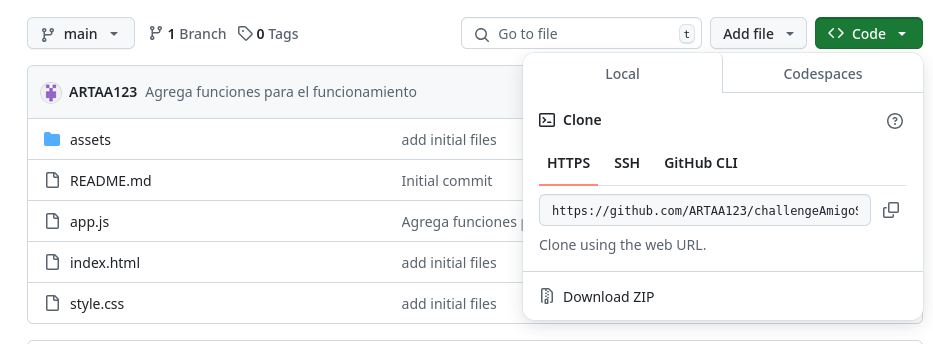
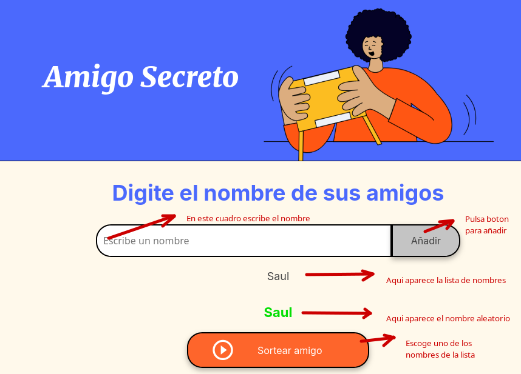

# Challenge Amigo Secreto
Este proyecto es un juego para determinar un **amigo secreto** de forma aleatoria

## ⚒️: Funcionalidades del programa
- El juego permite agregar nombres de personas.
- Al tiempo que se agregan los nombres se listan en la pantalla.
- Selecciona un nombre aleatoriamente de la lista brindada.

## 🧰: Como utilizar la aplicación

1. Descarga los archivos del repositorio
   
  
2. Da doble click en el archivo index.html
 > Al realizar esto aparecera la siguiente pagina y de la cual se describen las diferentes secciones.
  

Una vez realizados los pasos anteriores solo queda disfrutar del juego...
